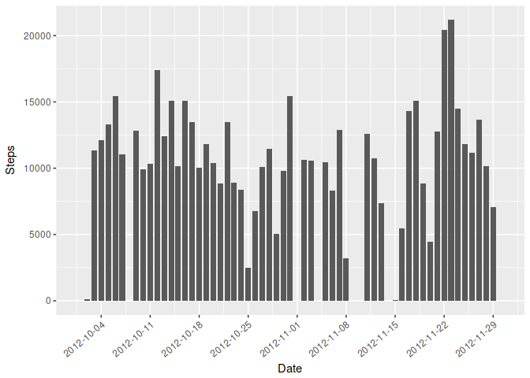
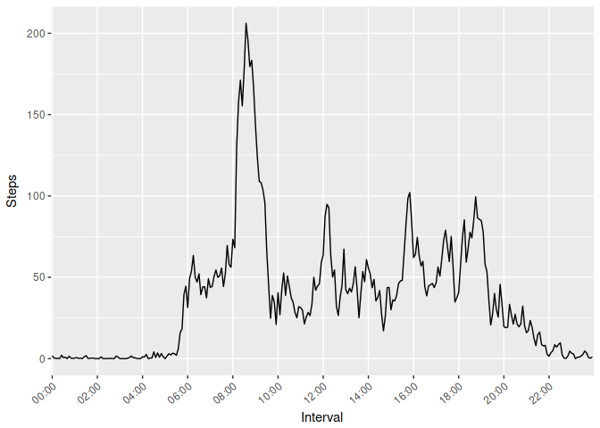
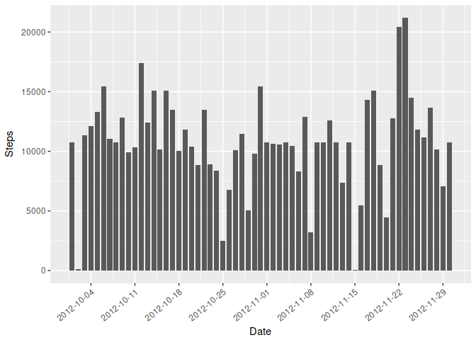
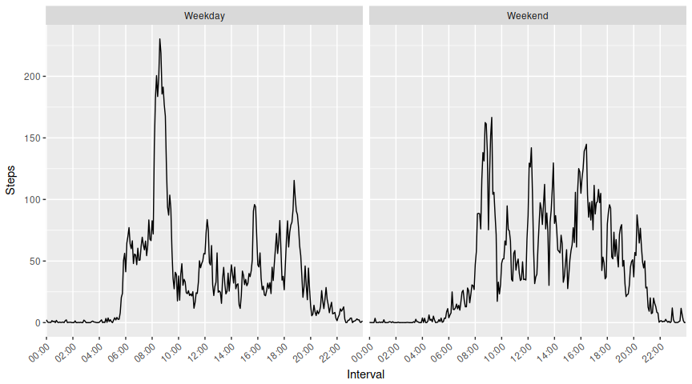

<br><br>

This document describes a set of personal movement using an activity monitoring device for an
anonymous person for the Johns Hopkins University Coursera course "Reproducible Research"

We will begin by loading libraries that we'll need later. ggplot2 because ggplot2, stringr
especially for some string padding we'll be doing with times. Also I want to center my plots
and the assignment says to hide nothing, so here's the knitr directive.


```r
library(ggplot2)
library(stringr)
knitr::opts_chunk$set(fig.align="center")
```

<br><br>

## Loading and preprocessing the data
Now we must load the data. We have three variables: number of steps taken, date, and the
five minute interval in which the steps were taken.


```r
data <- read.csv(unz("activity.zip", "activity.csv"))
```

We will convert the date field and interval field into one POSIXlt datetime field. We'll go ahead and
drop the interval and date fields to free RAM, too, since all the necessary info is now in datetime.


```r
data$datetime <- with(data, strptime(paste(date, str_pad(interval, 4, pad = "0")), format = "%Y-%m-%d %H%M"))
data <- subset(data, select = c("steps", "datetime"))
```

<br><br>

## What is mean total number of steps taken per day?
Now to get to work. We compute the total daily steps taken. NA step values will also be replaced with
0's to prevent warnings from geom_col. However, we have to use a different variable, as the NA's
need to stay NA's in the main set or it will throw off the average later!


```r
daily_tot <- with(data, aggregate(list(Steps = steps),
                                  by = list(Date = as.Date(strftime(datetime, "%Y-%m-%d"),  format = "%Y-%m-%d")), 
                                  sum, rm.na = TRUE))
daily_tot_nona <- daily_tot
daily_tot_nona[is.na(daily_tot_nona$Steps),]$Steps <- 0
ggplot(data = daily_tot_nona, aes(x = daily_tot_nona$Date, y = daily_tot_nona$Steps)) +
  geom_col(width = .8) + 
  scale_x_date(date_breaks = "7 days", date_labels = "%Y-%m-%d") +
  theme(axis.text.x = element_text(angle = 40, hjust = 1)) +
  labs(x = "Date", y = "Steps")
```



That's a nice visualization, but let's take a look at the actual mean and median per day values.
For these, remember, we'll have NA values so let's ignore those.


```r
daily_avg <- mean(daily_tot$Steps, na.rm = TRUE)
daily_mdn <- median(daily_tot$Steps, na.rm = TRUE)
cat("Average steps per day: ", daily_avg, "\nMedian steps per day: ", daily_mdn, "\n")
```

```
## Average steps per day:  10767.19 
## Median steps per day:  10766
```

<br><br>

## What is the average daily activity pattern?
Let's see the average daily activity, using the interval indexes across all days. This will show
what times of day our anonymous subject was most active (where activity is measured in steps, anyway.)

This time we will need to aggregate not on date, but on the interval/time, so as to average values per day,
over the interval/time of day.

```r
interval_tot <- with(data, aggregate(list(Steps = steps), 
                                     by = list(Interval = format(datetime, "%H:%M")), 
                                     mean, na.rm = TRUE))
```

Now let's plot this in a nice time series line graph.

```r
ggplot(interval_tot,  aes(interval_tot$Interval, interval_tot$Steps, group = 1)) +
  geom_line() +
  scale_x_discrete(breaks = paste0(str_pad(seq(0, 24, 2), 2, pad = "0"), ":00")) +
  theme(axis.text.x = element_text(angle = 40, hjust = 1)) +
  labs(x = "Interval", y = "Steps")
```



Wow, it looks like this person goes back and forth from their desk to get ***A LOT*** of coffee at
the beginning of the work day.

<br><br>

## Imputing missing values
Up until this point we have been throwing out NA values. Let's see how big of an NA problem we have
which may be throwing off our assumptions. Let's determine the scope of the problem by just seeing
how many rows with NA's we have.

Let's begin by assuming there are no values in the datetime column. We can assume this because: 1)
we didn't get any errors converting to datetime from integer dates and times, and 2) I checked. Steps,
therefore, are all we have to worry about.

```r
sum(is.na(data$steps))
```

```
## [1] 2304
```

That's quite a few... let's replace them by imputing some values and see what it does to our previous
calculations. For this simple purpose, we'll assume that the time of day activity is most strongly
correlated with reality, so we'll impute from the time (ie., interval from the original dataset.)

This is accomplished by virtue of ave(). We pass ave() the hours and minutes to replace NA values
with the mean of the same time's values. We'll store that in a new variable.

```r
no_na_data <- data
no_na_data$steps <- with(no_na_data, ave(steps, strftime(datetime, "%H%M"),
                             FUN = function (x) replace(x, is.na(x), mean(x, na.rm = TRUE)))
                   )
```

Let's generate a new plot and calculate the new mean and median to see how this has affected our
previous analysis. We'll copypasta our previous plot code and change some variables.

```r
daily_nona <- with(no_na_data, aggregate(list(Steps = steps),
                                  by = list(Date = as.Date(strftime(datetime, "%Y-%m-%d"),  format = "%Y-%m-%d")), 
                                  sum, rm.na = TRUE))
ggplot(data = daily_nona, aes(x = daily_nona$Date, y = daily_nona$Steps)) +
  geom_col(width = .8) + 
  scale_x_date(date_breaks = "7 days", date_labels = "%Y-%m-%d") +
  theme(axis.text.x = element_text(angle = 40, hjust = 1)) +
  labs(x = "Date", y = "Steps")
```



Well, that's not too different. Certainly we have a few days that have bars now that didn't then.
A few jumped up a bit. It's not surprising that it's not too different, after all, the NA values
were only 15% or so of the total.
<br><br>

## Are there differences in activity patterns between weekdays and weekends?
Let's determine whether there is a difference in activity between weekdays and weekends. Is this
person actually getting tons of coffee 8:00-10:00? Maybe they're just long distance weekend runners.
It would be a horrible shame if we branded them with a significant caffeine problem unnecessarily.

We'll begin by creating a factor column with the data. This would be very easy to do from here
anyway since we converted the date and interval to POSIXlt way long ago, and is entirely unnecessary,
but the homework says to do it and therefore we will do it. Hey, this will be super easy regardless,
we're just wasting a little RAM.

```r
no_na_data$weekday <- as.factor(strftime(no_na_data$datetime, "%A"))
```

Yep, that was pretty convenient.

Now let's plot it up and see what we can see. Workplace coffee addict or weekend distance runner?
Both? We'll find out. First, let's cheat. The homework says to do weekdays so we've done weekdays.
We're going to just make a simple 2-value factor for weekend and weekday. We'll also split out a
time column again to make aggregating by formula easier.

```r
no_na_data$daytype <- as.factor(ifelse(no_na_data$weekday %in% c("Saturday", "Sunday"), "Weekend", "Weekday"))
no_na_data$time <- format(no_na_data$datetime, "%H:%M")
```

Yeah, that's going to make a comparison plot super trivial. Now we'll copypasta our previous time
series graph, change some variables, and do a side-by-side with ggplot facets.

```r
interval_no_na <- aggregate(steps ~ time + daytype, no_na_data, mean)
ggplot(interval_no_na,  aes(interval_no_na$time, interval_no_na$steps, group = 1)) +
  geom_line() +
  scale_x_discrete(breaks = paste0(str_pad(seq(0, 24, 2), 2, pad = "0"), ":00")) +
  theme(axis.text.x = element_text(angle = 40, hjust = 1)) +
  labs(x = "Interval", y = "Steps") +
  facet_grid(. ~ daytype)
```



Verdict? Probably big into work coffee. A little home coffee, too, sure... but definitely hitting
the office coffee maker. It is worth noting that before, when we imputed previously NA values, we
used the time of day to average out the NA values. This would likely have had the effect of smoothing
out any differences between weekdays and weekends, depending on how the NA values were distributed.
